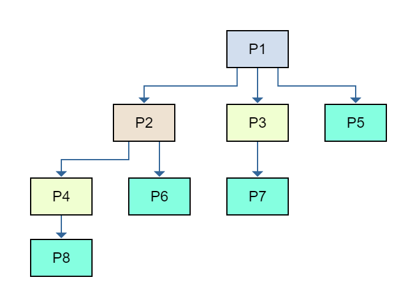

1. The issue would occur immediately after the `unlock mutex.spinlock` line is executed. At this point, the current thread is still in the `runnable threads` and as such, could reclaim the mutex and execute again. This is not ideal since it does not allow other threads to claim the mutex and run.

2. The issue occurs since the two calls of `state.get()` are not guaranteed to be referencing the exact same object. Between these two lines, there is a chance that `state` was changed, which would result in an inconsistent returned value from state.get(). Establishing the `snapshot` variable solves this problem by ensuring that both lines reference the same state of `state`.

9.\
1493 ttys001 0:00.00 ./problem9.o 1494 ttys001 0:00.00 ./problem9.o 1495 ttys001 0:00.00 ./problem9.o 1496 ttys001 0:00.00 ./problem9.o 1497 ttys001 0:00.00 ./problem9.o 1498 ttys001 0:00.00 ./problem9.o 1499 ttys001 0:00.00 ./problem9.o 1500 ttys001 0:00.00 ./problem9.o

    
